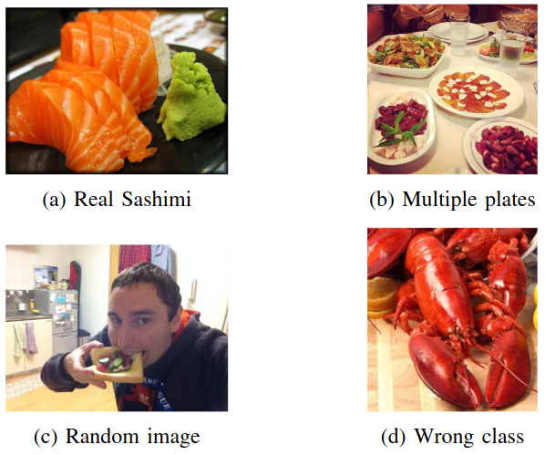

# Image and Text fusion for UPMC Food-101 using BERT and CNNs
The  modern  digital  world  is  becoming  more  andmore  multimodal.  
Looking  on  the  internet,  images  are  often associated  with  the  text,  so  classification  problems  with  thesetwo  modalities  are  very  common.  
In  this  paper [1],  we  examine multimodal  classification  using  textual  information  and  visual representations  of  the  same  concept.  
We  investigate  two  main basic methods to perform multimodal fusion and adapt them with stacking techniques to better handle this type of problem. 
Here, we use UPMC Food-101, which is a difficult and noisy multimodal dataset that well represents this category of multimodal problems.
Our   results   show   that   the   proposed   **early   fusion   technique combined  with  a  stacking-based  approach**  exceeds  the  state  ofthe  art  on the  dataset used.

## Usage
Use Jupyter notebook.
The source code can be used to replicate all the experiments contained in the paper [1].

## Dataset
The used dataset is [UPMC Food-101](http://visiir.lip6.fr/explore) a very difficult dataset.
In the following image, four images taken from the sashimi class of UPMCFood-101. 
In (a) a real image of sashimi; 
the image in (b) contains more dishes so it’s hard to understand if it’s sashimi;
In the sub-figure (c) an example of the sashimi class containinga random image; 
while in (c) we have a wrong examplecontaining the image of another class of the same dataset.



## Results
| Method | Accuracy(%) |
| ---      |  ------  |
| Image (InceptionV3)   | 71.67 | 
| Text (Bert) | 84.41 | 
| Late fusion   | 84.59 | 
| Early fusion   | 92.50 | 

## Citation
```
@INPROCEEDINGS{Gallo:2020:IVCNZ:Food101, 
  author   ={Ignazio Gallo, Gianmarco Ria, Nicola Landro and  Riccardo La Grassa}, 
  booktitle={International Conference on Image and Vision Computing New Zealand (IVCNZ 2020)}, 
  title    ={Image and Text fusion for UPMC Food-101 using BERT and CNNs}, 
  year     ={2020}, 
  month    ={Nov},
  pages    ={1-6},
  doi      ={10.1109/IVCNZ51579.2020.9290622}, 
  ISSN     ={2151-2205}, 
}
```

## References
[1] [The paper: Image and Text fusion for UPMC Food-101 using BERT and CNNs (IVCNZ 2020)](http://artelab.dista.uninsubria.it/res/research/papers/2020/2020-IVCNZ-Gallo-Food101.pdf)

